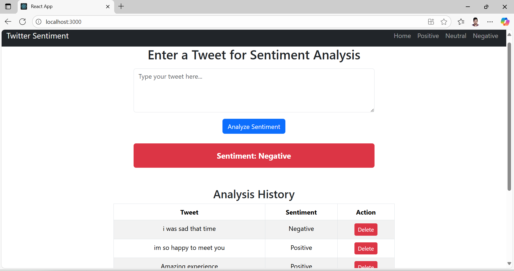
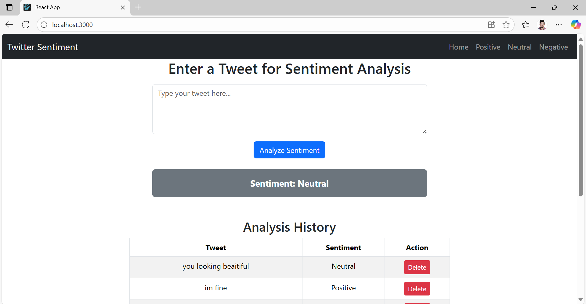

## -------------------------------------------------------------------------------
Twitter Sentiment Analysis — Full Stack (Flask + React)
## -------------------------------------------------------------------------
# Overview

I developed this Twitter Sentiment Analysis web application as a full-stack project using Flask (Python) for the backend and React.js for the frontend.
It analyzes tweets or text entered by the user and classifies them as Positive, Negative, or Neutral using the VADER Sentiment Analyzer from NLTK.

## Tech Stack
Layer	Technologies
Frontend	React.js, Axios, Bootstrap
Backend	Flask (Python), Flask-CORS
NLP / ML	NLTK — VADER SentimentIntensityAnalyzer
Tools	Visual Studio Code, Node.js, Python, Git, GitHub
## -------------------------------------------------------------------
## Project Structure
## --------------------------------------------------------------------
twitter_sentiment/
│
├── backend/                # Flask backend
│   ├── app.py              # Main Flask API (VADER logic)
│   ├── train_model.py      # (Optional) Training script
│   ├── tweets.csv          # Dataset for training/testing
│   └── requirements.txt    # Python dependencies
│
├── frontend/
│   └── twitter-frontend/   # React frontend
│       ├── src/            # React source code (Axios calls)
│       ├── public/         # Static files
│       ├── package.json
│       └── .gitignore
│
└── output_screenshots/     # App screenshots
## ------------------------------------------------------------------------
## Features
1.Real-time sentiment prediction using VADER (NLTK)
2.REST API built with Flask
3.React.js frontend with live user input
4.Cross-origin integration via Flask-CORS
5.Responsive design using Bootstrap
6.Simple architecture ready for deployment

## Getting Started

# Backend Setup (Flask API)
# Navigate to backend
cd backend

# Create and activate virtual environment
python -m venv venv
venv\Scripts\activate  # Windows

# Install dependencies
pip install flask flask-cors nltk

# Run Flask server
python app.py


Flask will run at http://127.0.0.1:5000

## ----------------------------------------------------------
## Frontend Setup (React App)
## ----------------------------------------------------------
# Navigate to frontend
cd frontend/twitter-frontend

# Install dependencies
npm install

# Start React app
npm start


React will run at http://localhost:3000

## (Optional) add a shortcut:

npm set-script dev "npm start"
npm run dev
## -----------------------------------------------------
## Backend–Frontend Integration
## -----------------------------------------------------
Flask API Endpoint (app.py)
@app.route('/analyze', methods=['POST'])
def analyze():
    data = request.get_json()
    text = data.get('text', '')
    scores = sia.polarity_scores(text)
    compound = scores['compound']

    if compound >= 0.05:
        sentiment = 'Positive'
    elif compound <= -0.05:
        sentiment = 'Negative'
    else:
        sentiment = 'Neutral'

    return jsonify({'sentiment': sentiment})

## React Frontend Call
axios.post("http://127.0.0.1:5000/analyze", { text: inputText })
  .then(res => setSentiment(res.data.sentiment))
  .catch(err => console.error(err));
## -----------------------------------------------------------------------------
## Screenshots
1.Home Page
2.Positive Sentiment
3.Neutral Sentiment
4.Negative Sentiment
5.History
6.Output Examples

## 📸 Screenshots

### 🏠 Home Page


### 😊 Positive Sentiment


### 😐 Neutral Sentiment


### 😠 Negative Sentiment


### 📊 History / Result Screens


### 🧾 Result Output Samples





## Learning Outcomes

1.Building this project helped me:
2.Understand full-stack app integration (Flask ↔ React)
3.Use VADER for real-world sentiment analysis
4.Handle REST API communication and CORS
5.Manage React state and API results effectively
6.Prepare a deployable full-stack ML application

## Developer
## Developed by: Paramesh Laleppagari
Email: paramesh.itcareers@gmail.com
LinkedIn: www.linkedin.com/in/paramesh-laleppagari

## Future Enhancements

1.Integrate Twitter API (Tweepy) to fetch live tweets
2.Add data visualization charts (Recharts / Chart.js)
3.Deploy backend on Render and frontend on Netlify for live demo

## ----------------------------------------------------
## Project Deployment to (Render) for live link:
# -----------------------------------------------------

This project has been successfully deployed using Render
 — a cloud platform that supports both backend APIs and frontend web apps.

## Backend Deployment
``` bash
Platform: Render Web Service

Framework: Flask (Python)

Purpose: Provides the sentiment analysis API endpoint (/analyze)

Deployment Steps:

Created a new Web Service on Render

Connected the GitHub repository

Selected the backend directory containing app.py and requirements.txt

Set the Start Command as:

gunicorn app:app


Render automatically installed dependencies and deployed the backend service

✅ Live Backend URL:
👉 https://twitter-sentiment-analysis-1-uq1a.onrender.com

## ------------------------------------------
## Frontend Deployment
# ----------------------------------------
Platform: Render Static Site

Framework: React.js

Purpose: Provides the user interface for entering tweets and displaying sentiment results

Deployment Steps:

Built the React app using

npm run build


Pushed the build folder and source code to GitHub

Created a Static Site on Render

Linked it to the frontend folder (frontend/twitter-frontend)

Render automatically built and deployed the frontend

✅ Live Frontend URL:
👉 https://twitter-sentiment-analysis-front.onrender.com

```